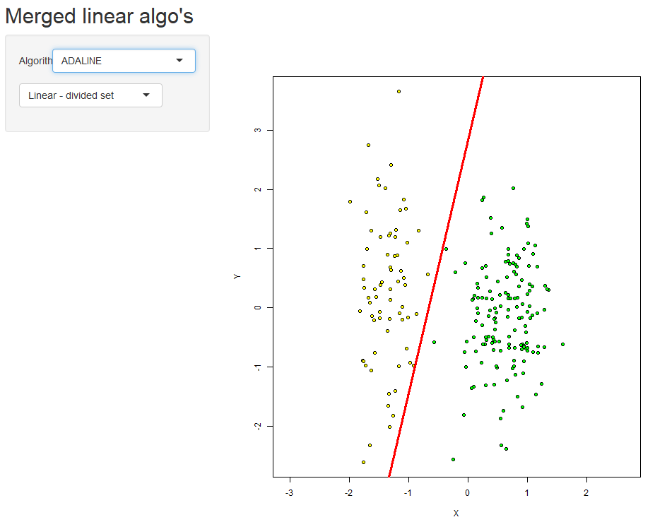
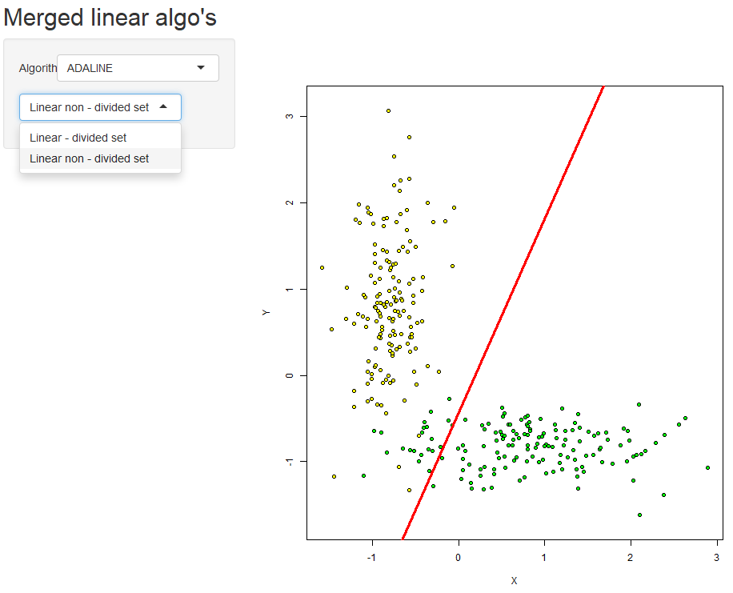
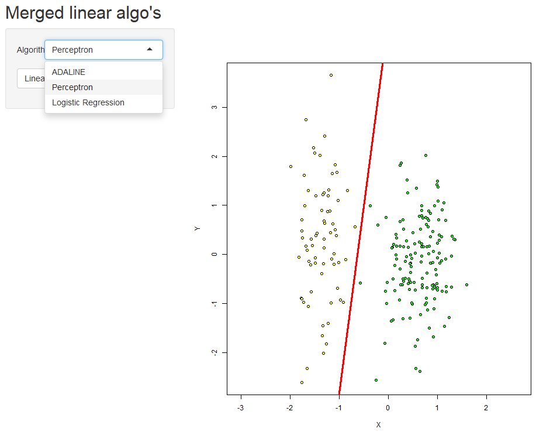
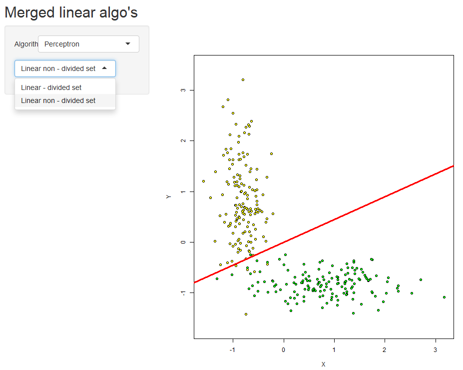
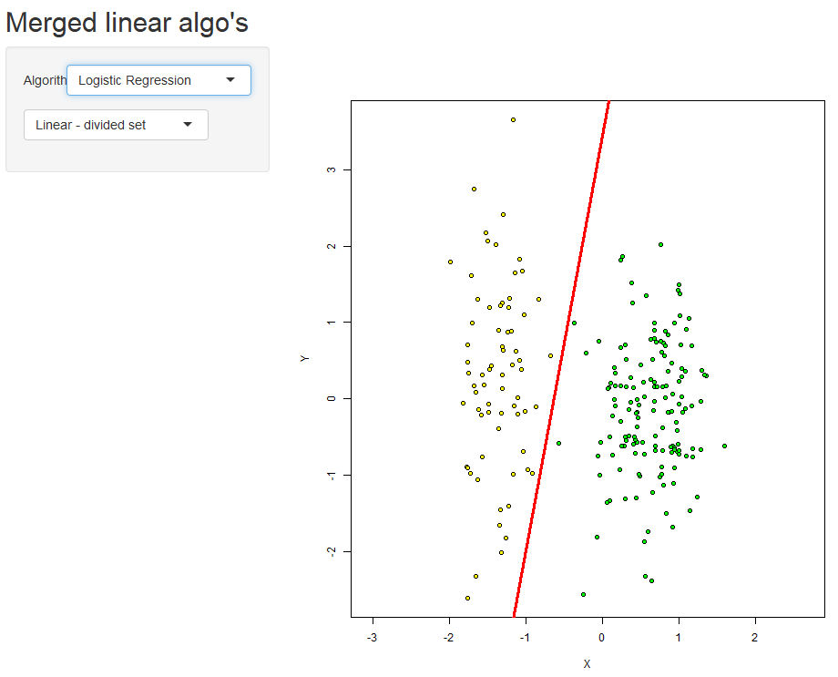
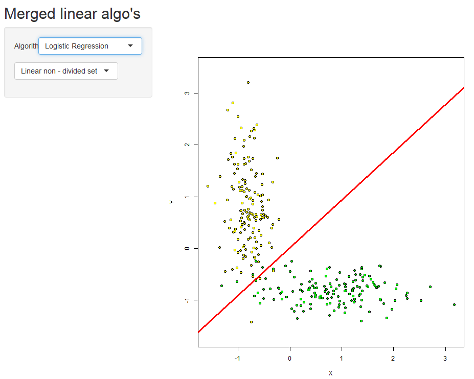

***Линейные алгоритмы классификации***  

Рассматривается задача классификации с двумя классами **Y={-1,+1}**. Модель алгоритма - параметрическое отображение ***a(x,w) = sign f(x, w)***  , где ***w - вектор параметров***, а ***f(x, w)*** - *дискриминантная функция*. 

Если её значение **> 0**, объект относится к классу **+1**, иначе **-1**. Уравнение ***f(x, w) = 0*** описывает разделяющую поверхность. 

 - *отступ* объекта  относительно классификатора. Если отступ отрицательный - алгоритм ошибся в классификации на объекте. Больше отступ - правильнее и надёжнее классификация объекта .  

 - *функция потерь*, а функция отступа - монотонно невозрастающая, мажорирующая пороговую ф-ю потерь : . Тогда минимизация суммарных потерь - это метод минимизации числа ошибок на выборке: 

 

Если дискриминантная функция - , получим ***линейный классификатор***:  

***Стохастический градиент***  

Необходимо найти вектор параметров , где достигается минимум эмпирического риска.

Веса _w_  подбираются в цикле, на каждом шаге веса сдвигаются в направлении антиградиента  
  

Алгоритм получает обучающую выборку, темп обучения  и параметр сглаживания . Перед применением метода выборка подготавливается и нормируется:  

__Признаковое нормирование__

, где _m_ – среднее арифмитическое значение признака _j_,

– среднеквадратическое отклонение.

__Подготовка__

Разделяющая поверхность
.

У нас объект имеет всего два признака.
.
У разделяющей прямой нет св. коэфф-та, добавим фиктивный параметр *=-1* :
.

***Подробный алгоритм SG***

1. Инициализация весов
.

2. Вычисление начального приближения

3. ***Пока  _Q_ не стабилизировано*** и в выборке присутствуют объекты с отрицательным **М**, ***повторять:***  
Условия выше иногда может быть не достаточно, алгоритм может остановиться, не получив необходимого результата, если два раза подряд выберет похожие элементы. Увеличим количество повторов выбора до десяти во избежание этого (меньшие значения были также проверены, и их было недостаточно).
 
4. Выбрать случайный элемент  
5. Ошибка: 
6. Шаг градиентного спуска: 
7. Оценка: 

Линейные алгоритмы отличаются функцией потерь

, где

– отступ.

***ADALINE***

Линейный алгоритм классификации, основан на методе стохастического градиента
. - квадратичная функция потерь.
Производная берётся по _w_ и равна .  
Получили правило обновления весов на каждой итерации метода *SG* - **дельта - правило:**
.

 [Программная реализация](https://zoncker.shinyapps.io/LinearMerged/) была выполнена с использованием библиотеки Shiny(Бесплатный хост - это нечто!) для построения графического интерфейса (пусть и ужасного), стохастический градиент был унифицирован для трёх классификаторов, также на выбор пользователю предлагается два набора параметров задания выборки, когда она линейно - разделима и когда - нет. [Исходник](../LinearMerged/app.R)
 
 Результаты работы:
 
  
 
 ***Персептрон Розенблатта***
 
 
Отличается от линейного адаптивного элемента _функцией потерь_ - тут она **кусочно-линейная** : 
  
и правилом обновления весов - _правило Хэбба:_

если
;  .

  
 
 ***Логистическая регрессия*** - линейный алгоритм классификации, также являющийся оптимальным байесовским. Как и предыдущие, использует **SG** и также основан на довольно сильных вероятностных предположениях. Функция потерь - логистическая:
.

Правило обновления весов тоже другое, *логистическое*:

, а  - сигмоидная функция.

  
