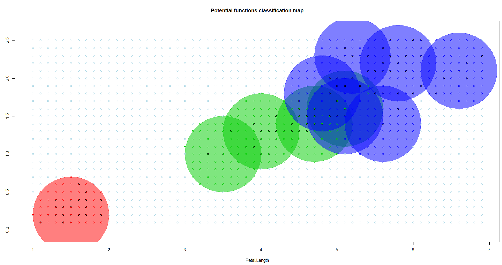
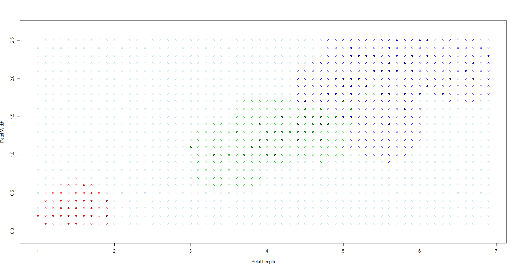

# Potential functions

- **Метод потенциальных функций** - метрический алгоритм классификации, основанный на идее электростатического взаимодействия элементарных частиц. В этой идее основным оперируемым понятием является _потенциал_, мера воздействия электростатического поля элементарной заряженной частицы (в некоторой точке пространства, конечно) , которая равна отношению ***заряда*** частицы **Q** к расстоянию до частицы ***(r)*** : 

Данный метод при классификации объекта проверяет его на близость к объектам их выборки. Предполагается, что оные _"заряжены"_ классом, к которому они принадлежат, и мера важности зависит от заряда и расстояния до классифицируемого объекта.  

В общем виде алгоритм **_kNN_** выглядит так :
,
где  — мера _«важности»_ (вес) объекта 

Метод же потенциальных функций заключается в использовании весовой функции 
, где    
K - заданная, убывающая с ростом аргумента, функция. Аналог ядра из метода Парзеновского окна;  
_p_ - расстояние от u до _i_-го ближайшего объекта;  
h - ширина потенциала, опять же, аналог с PW;  
 - "заряд", степень важность объекта выборки при классификации.


### Code implementation

Src: [тыц](../PF.R)  
Основной интерес реализации заключён в функции подсчёта потенциалов (сама функция метода практически аналогична Парзеновскому окну, происходит лишь дополнительное домножение на вектор потенциалов):

## Potentials
```R
DT.PF.potentials = function(points, classes, h, treshold) { #нововведение - вводится граница допустимых ошибок, после
    n = dim(points)[1] #достижения которой мы прекращаем пересчёт потенциалов
    potentials = integer(n)

    mistakes = treshold + 1 #начальное условие для захода в основной цикл
    while (mistakes > treshold) { #пока количество ошибок на предыдущей итерации больше заданного уровня
        exec = true #использование булевого значения для продолжения внутреннего цикла цикла
        while (exec) { # и выхода по изменению оного же
            i = sample(1:n, 1) #sample в заданном радиусе выбирает один случайный элемент
            u = points[i,] #в нашем случае - это индекс объекта выборки
            distances = DT.Util.getDist(points, u, DT.Util.euclidDist)
                #если функция классификатора ошибается на объекте, то его потенциал увеличивается
            if (DT.PF.PF(distances, classes, potentials, h) != classes[i]) {
                potentials[i] = potentials[i] + 1 #и мы выходим внутреннего цикла поиска объекта, на котором 
                exec = F #классификатор ошибётся
            } #условие выхода из while
        }

        mistakes = 0 #обнуляем счётчик ошибок 
        for (i in 1:n) {
            u = points[i,] #проводим классификацию обучающей выборки с уже новыми потенциалами и сравниваем 
            distances = DT.Util.getDist(points, u, DT.Util.euclidDist)
                #с истинными значениями классов объектов
            if (DT.PF.PF(distances, classes, potentials, h) != classes[i]) {
                mistakes = mistakes + 1 #если, опять же, алгоритм ошибся, увеличиваем ошибку
            }
        }# блок вывода результатов итерации и return опущен, дабы не загромождать ещё сильнее ридми
}
```
Также, для красоты визуализации была использована библиотека **plotrix** и её методы для отрисовки окружностей с заданной плотностью ( соответствующий параметр метода - прозрачность, на самом деле)

### Summary

 

Один из двух параметров, который в данном методе необходимо было подбирать вручную - ширина потенциала, была взята для всей выборки величиной 0.5. На скриншоте с картой классификации без отрисовки окружностей - потенциалов радиуса **0.5** видно, что класссификация не является точной.  

Далее, параметр порога ошибки был взят величиной **5**, который при результате на скриншотах был достигнут за 12 итераций.  

Следует заметить, что алгоритм достаточно _непостоянен_, что исходит из производимых действий в нём (взятие случайной точки выборки);  

Также, нельзя гарантировать, что с каждой итерацией количество ошибок будет уменьшаться, всё из тех же соображений, при особо высоком пороге (очень маленьком значении допустимых ошибок) алгоритм может выполняться ОЧЕНЬ долго, что было проверено лично.  

Из недостатков, кроме вышеупомянутой крайне медленной сходимости, можно выделить факт в целом очень грубого(ручного) подбора параметров.  
Из плюсов можно выделить простоту понимания и, в общем - то, реализации.

----

[go to index](../../README.md)

[Next - STOLP](STOLP.md)
