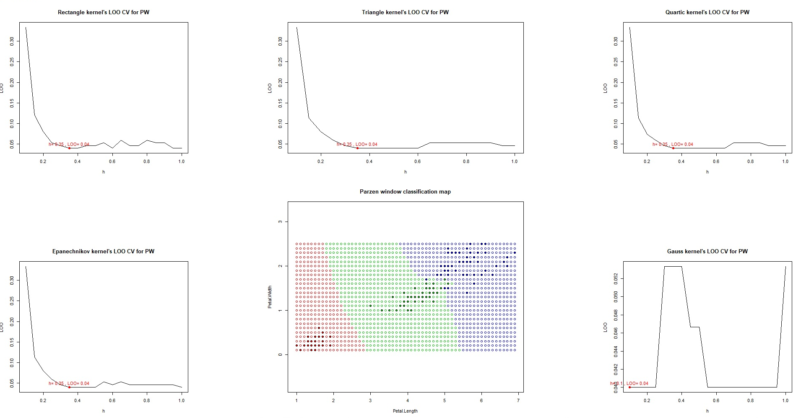

# Parzen window

**Метод парзеновского окна** - классификатор,в котором вводится понятие функции ядра K(z), невозрастающую на  и рассмотрим алгоритм
    
Параметр _h_ называется _**шириной окна**_ и играет примерно ту же роль, что и число соседей **k**.
«Окно» — это сферическая окрестность объекта u радиуса _h_, при попадании в которую обучающего объекта  объект _u_ «притягивается» к классу .
Широко распространены такие ядра:

Для определения оптимального _h_ опять же используем **LOO**.

### Code implementation

Src: [тыц](../PW.R)

В данной работе использовалась новая функция для отрисовки ядер с LOO для каждого, ввиду громоздкости листинга здесь она не освещена.
По аналогии с предыдущими работами, использовалась немного видоизменённая функция LOO, которая вызывалась в цикле функции выше, и основная функция :
```R
DT.PW.PW = function(distances, classes, h) {
  distances = distances / h #реализация основной формулы алгоритма - деление расстояния на ширину ядра
  distances = DT.PW.currkernel(distances) #currKernel - своеобразная ссылка на функцию ядра, аргументом
  #которого является выражение выше
  classes = unique(classes)
   #делаем сет - уникальных элементов из classes и практически повторяем функцию из предыдущей работы
  w = sapply(classes, function(name, arr) sum(arr[names(arr) == name]), distances)
  names(w) = classes

  if (max(w) == 0) return("fail") #немного неактуально из - за использования гауссовского ядра
  
  return(names(which.max(w)))
}
```
### Summary



Используется датасет iris по лепесткам для классификации.

На чартах LOO для каждого ядра можно заметить, что наилучшим результатом отработало гауссово ядро.Стоит заметить, что несмотря на небольшие отличия, оптимальное _h_ для первых четырёх ядер одинаковое. 

С прогонкой алгоритма для гауссовского ядра ушёл и недостаток — неспособность классифицировать ***все*** точки. В случае первых четырёх ядер _h_ = 0.35, что приводило к тому, что существовали точки (даже большее количество, если брать карту классификации), в радиусе которых не окажется известных точек. Тогда эти точки не классифицировались, отмечались другим цветом на карте.

----
[go to index](../README.md)  

[next - PF](PF.md)


