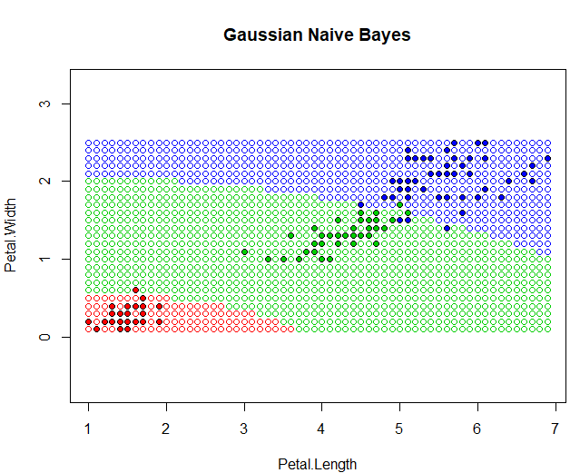
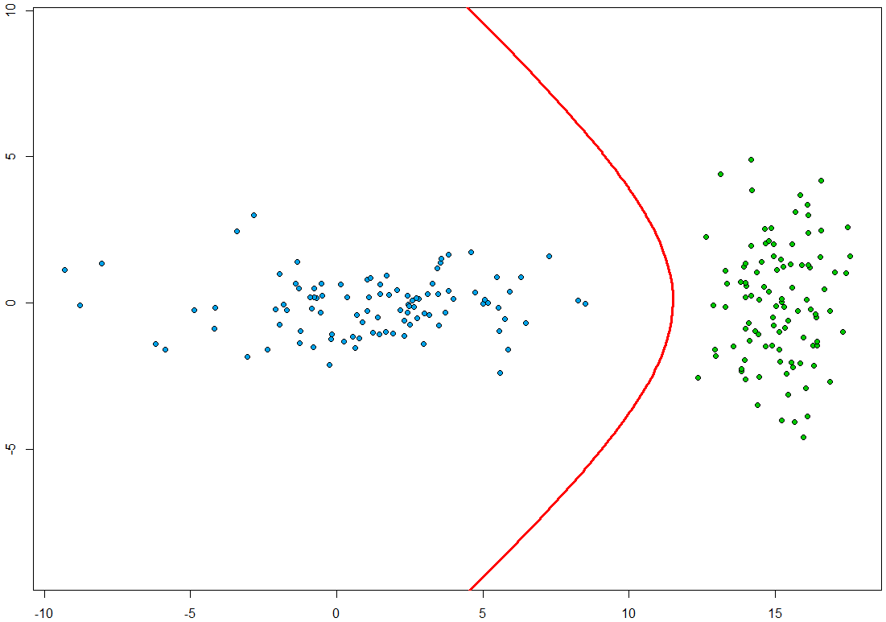
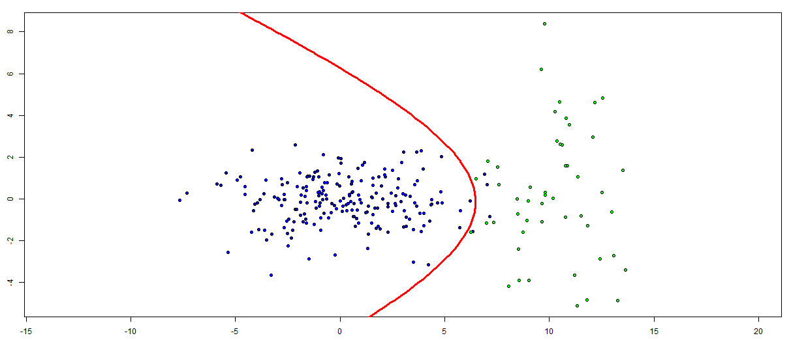
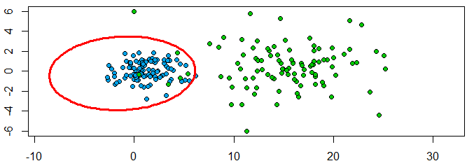
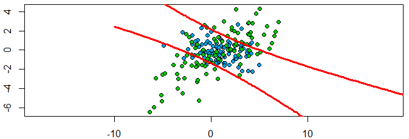
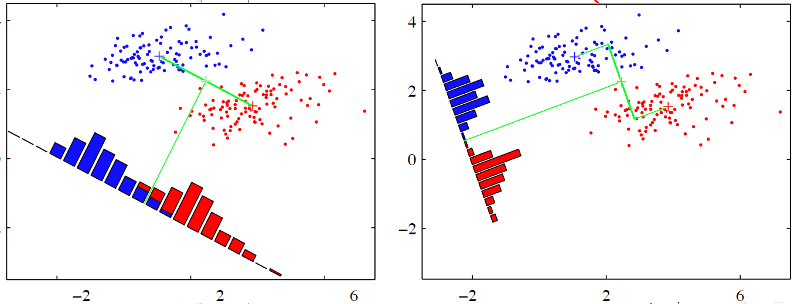
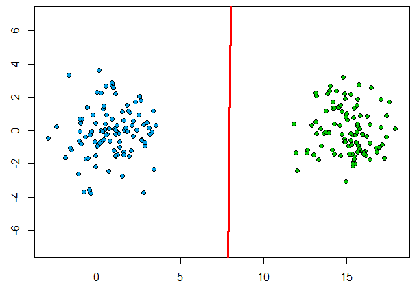

***Байесовские алгоритмы классификации***  
Байесовские алгоритмы классификации основаны на принципе максимума апостериорной вероятности : для классифицируемого объекта вычисляются плотности распределения   — **_функции правдоподобия_** классов, по ним вычисляются ***апостериорные вероятности*** - , где - ***априорные вероятности*** классов. Объект относится к классу с максимальной апостериорной вероятностью.

*Задача классификации* - получить алгоритм , способный классифицировать произвольный объект .  

1)  ***Построение классификатора при известных плотностях***  
 - штраф за неправильное отнесение объекта класса ***𝑦***.  
Если известны   и , то минимум среднего риска ,   достигается алгоритмом 

2) ***Восстановление плотностей по выборке***  
По подвыборке  класса *y* строим эмпирические оценки   (доля объектов в выборке) и .  
Три метода:  
**1)Параметрический** если плотности нормальные (гауссовские) - НДА и ЛДФ;  
**2)Непараметрический** - оценка Парзена - Розенблатта, метод парзеновского окна;   
**3)Разделение смеси** производится _ЕМ-алгоритмом_. Плотности компонент смеси (гауссовские плотности) - радиальные функции,метод радиальных базисных функций.

***Наивный нормальный байесовский классификатор***

Все объекты описываются _n_ числовыми признаками, . Сама наивность классификатора состоит в предположении, что все признаки  - независимые случайные величины, и тогда функции правдоподобия классов (совместные плотности) : , где  - плотность распределений значений _j_-го признака для класса _y_.  

Оценка **n** одномерных плотностей проще, чем одной n-мерной. Подставляя оценки  в _ОБРП_, получим байесовский классификатор:  


В случае, если классы равнозначны , байесовское правило - ***принцип максимума апостериорной вероятности***. Если они ещё и равновероятны  (это и предыдущее условие выполняется для выборки ирисов Фишера), то объект относится к классу с наибольшим значением совместной плотности  в точке.  

Всё, что требуется сделать - посчитать плотности на каждом признаке элемента, перемножить их, повторить для всех классов и найти максимальную. Плотность у нас нормальная (гауссовская):
, где  - матожидание j-го признака класса y,  - дисперсия j-го признака класса y.

[исходник](../NBA.R) 



**Pros** - Простота реализации, низкие вычислительные затраты для обучения и классификации. **Cons** - низкое качество классификации.

***Линии уровня многомерного распределения***

[Программная реализация](https://zoncker.shinyapps.io/LLines/), в интерфейсе доступна визуализация всех особых случаев с описанием. (Спасибо Shiny за бесплатный хост приложений). [исходник](../LLines/app.R)
```R
#функция для подсчёта многомерного нормального распределения
  x = matrix(c(x, y), 1, 2) 
  1 / sqrt((2 * pi) ^ 2 * det(covar)) * exp(-0.5 * (x - mean) %*% solve(covar) %*% t(x - mean))
```
```R
      #границы значений
      x = seq(-10, 10, len = 100)
      y = x
      z = outer(x, y, function(x, y) { #применяем функцию МНР к данным с помощью sapply
        sapply(1:length(x), function(i) Bayes.MVND(x[i], y[i], mean, covar))
```

***NDA. Plug - in algorithm***

**Нормальный дискриминантный анализ** - один из вариантов байесовской классификации,где восстанавливаемые плотности - многомерные гауссовские: , где  - мат. ожидание (центр), а  - ковариационная матрица - симметричная, положительная и невырожденная.  

Находим параметры нормального распределения **(1)**, **(2)**  для  согласно **принципу максимального правдоподобия**, подставляем в формулу ***ОБРП*** и получаем ***подстановочный алгоритм***, или ***линейный дискриминант Фишера*** (если ковариационные матрицы равны для всех классов).

[Реализация с помощью Shiny](https://zoncker.shinyapps.io/PlugIn/)


[Исходник](../PlugIn/app.R) 

Для сгенерированных с помощью функционала библиотеки **MASS** данных (выборка с двумя классами) вычисляем центры по **(1)**:

```R
  cols <- dim(objects)[2]
  mu <- matrix(NA, 1, cols) #создаём вектор
  for (col in 1:cols)
  {
    mu[1, col] = mean(objects[,col]) #подсчёт среднего значения для каждой из компонент
  }
```
Далее, находим ковариационные матрицы классов по **(2)** :
```R
  rows <- dim(objects)[1]
  cols <- dim(objects)[2]
  sigma <- matrix(0, cols, cols) #нулевая квадратная матрица 
  for (i in 1:rows)
  {
    sigma <- sigma + (t(objects[i,] - mu) %*% # - оператор умножения матриц, t - transpose
                        (objects[i,] - mu)) / (rows - 1)
  }
```
Из теоремы задания байесовским классификатором квадратичной поверхности получим её уравнение
  
Логарифмируя, , - константа, не зависит от x.
Осталось вычислить коэффициенты квадратичного дискриминанта из двух квадратичных форм ln p(x) : 
```R
# кривая второго порядка: a*x1^2 + b*x1*x2 + c*x2 + d*x1 + e*x2 + f = 0
  invSigma1 <- solve(sigma1)#обратные матрицы
  invSigma2 <- solve(sigma2)
  f <- log(abs(det(sigma1))) - log(abs(det(sigma2))) +
    mu1 %*% invSigma1 %*% t(mu1) - mu2 %*% invSigma2 %*%
    t(mu2);
  alpha <- invSigma1 - invSigma2
  a <- alpha[1, 1] #коэффициент - элемент матрицы
  b <- 2 * alpha[1, 2]#полученный вычитанием обратных матриц
  c <- alpha[2, 2]
  beta <- invSigma1 %*% t(mu1) - invSigma2 %*% t(mu2)
  d <- -2 * beta[1, 1]#всё выводится из квадратичной формы
  e <- -2 * beta[2, 1]
  ##решаем проблему возвращения из функции набора параметров передачей их map-ом
  return (c("x^2" = a, "xy" = b, "y^2" = c, "x" = d, "y" = e, "1" = f))
```
**Результаты**

<figure>
 
 
 
 
  <figcaption>Признаки некореллированы - линии уровня плотности эллипсоидные, 
    с центром mu, оси параллельны ox/oy.</figcaption>
</figure>

Классы не равновероятны или не равнозначны - разделяющая гиперплоскость отодвигается дальше от более значимого класса.  

Ковариационные матрицы не диагональны и не равны - разделяющая поверхность квадратична и прогибается - менее плотный класс охватывает более плотный.

***Недостатки***

 - Функции правдоподобия классов могут отличаться от гауссовских: когда имеются дискретные признаки, принимающие  значения, или
когда классы распадаются на изолированные участки.
 - Если длина выборки меньше размерности пространства, **ℓy < n**, или среди признаков есть линейно зависимые, то ковар. матрица становится вырожденной. В этом случае обратная матрица не существует и метод вообще неприменим.
 - Выборочные оценки чувствительны к нарушениям нормальности распределений, в частности, к редким большим выбросам.

***Линейный дискриминант Фишера***

***Ковариационные матрицы*** классов равны, классы **s, t** равновероятны и равнозначны , признаки некоррелированы и имеют одинаковые ***дисперсии*** .  

Это означает, что классы имеют одинаковую сферическую форму, разделяющая плоскость проходит посередине между классами, ортогонально линии, соединяющей центры классов. Нормаль оптимальна - прямая, в одномерной проекции на которую классы разделяются наилучшим образом,с наименьшим байесовским риском **R(a)**.



Применяя  , квадратичные члены сокращаются и уравнение поверхности
вырождается в линейную форму: , где  - точка посередине между центрами классов.


[src](../FLD.R)

Код существенно не отличается от предыдущего алгоритма.

**Результаты**



Алгоритм неплохо работает, когда формы классов действительно близки к нормальным и не слишком сильно различаются.  

В этом случае линейное решающее правило близко к оптимальному байесовскому, но устойчивее квадратичного, и часто обладает лучшей обобщающей способностью.
