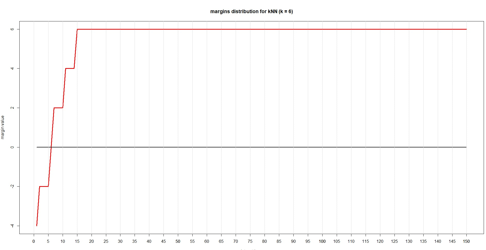
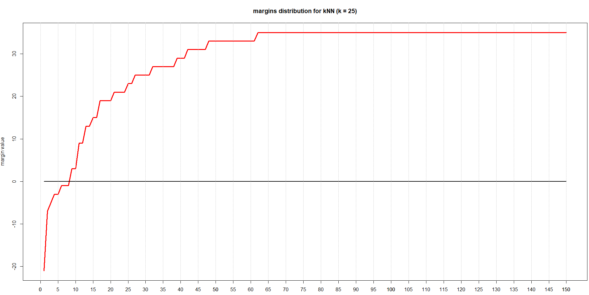
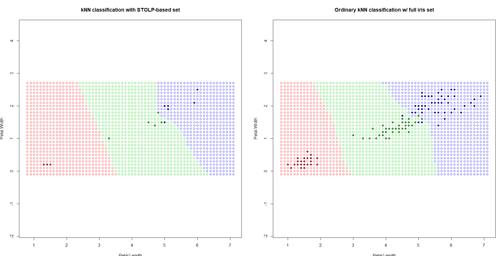

# STOLP

**Алгоритм STOLP**  
Данный алгоритм специфичен тем, что использует логичное допущение о том, что не все объекты обучающей выборки ***равноценны***. Среди них есть наиболее типичные представители классов, то есть _эталоны_ - находящиеся среди большого количества соседей своего класса; _неинформативные_ объекты, при удалении которых из обучающей выборки качество классификации не изменится; _выбросы_, или шумовые объекты — объекты, находящиеся в гуще «чужого» класса, только ухудшающие качество классификации.  

Данный алгоритм предлагает возможноость уменьшить объем выборки, оставив в ней только эталонные объекты для каждого класса. Как покажут(!) результаты, качество классификации при этом практически не изменится(sic!). Но, как говорится, обо всём по порядку.

**Эталоны и отступы/величины риска**  
В качестве эталонов _i_-го класса при классификации методом ближайшего соседа может служить такое подмножество объектов этого класса, что расстояние от любого принадлежащего ему объекта из выборки   до ближайшего «своего» эталона меньше, чем до ближайшего **_«чужого»_** эталона.  

**Отступ** - это показатель того, насколько плотно объект выборки окружён соседями своего класса. Эталоны, следовательно, имеют высокий положительный отступ, неинформативные - низкий положительный отступ, выбросы - высокий по модулю отрицательный etc. Формульно отступ выглядит таким образом : ,  
где  - множество эталонов.  

Величина риска (W) — величина, характеризующая степень риска для объекта быть классифицированным не в тот класс, которому он принадлежит. Для любого метрического алгоритма можно взять . 

Сам алгоритм подбора будет рассмотрен в следующей секции.

### Code implementation

Src: [тыц](../STOLP.R)

Исходного кода, который можно было бы приложить, было слишком много, поэтому ограничусь краткими вставками среди текста, дабы сильнее не загромождать readme.

Итак, собственно, сам алгоритм (метод DT.STOLP.STOLP):
1) Отсекаем от выборки выбросы, т.е объекты, имеющие отступ ниже заданной величины
```R
  for (i in 1:n) {  #идём по выборке
    if (i > n) break #избегаем ситуации, когда после уменьшения выборки итератор окажется больше
    if (DT.STOLP.getMargin(points, classes, points[i, ], classes[i]) <= noises) { #получаем отступ элемента
      points = points[-i,] #удаляем элемент из выборки
      classes = classes[-i] #из поля классов удаляем тоже
      n = n - 1 #уменьшаем количество
```  
2) Начинаем формировать множество отступов - берём по одному объекту каждого класса с максимальным **отступом**
```R
standards.classes = c() #создаём пустой вектор классов эталонов
  for (class in unique(classes)) {   #идём по составленному set-у классов
    index = which(classes == class)
    margins = sapply(index, function(i) DT.STOLP.getMargin(points, classes, points[i,], class)) 
    max.i = index[which.max(margins)] #выделяем индекс объекта с макс отступом
    #sapply позволила применить функцию подсчёта отступа ко всему вектору index
    standards = rbind(standards, points[max.i,]) #используем rbind для объединения строк матрицы, столбцы одинаковые
    standards.classes = c(standards.classes, class) #добавляем класс этой итерации к вектору
    points = points[-max.i,] #удаляем элементы из матрицы
    classes = classes[-max.i]
    n = n - 1
  ```  
3) Наращиваем эталоны до достижения нашего threshold'а :
 - классифицируем , с обучающей выборкой эталонов  
 - Пересчитываем отступы для всех , учитывая изменения обуч. выборки  
 - Среди объектов каждого класса, распознанных неправильно, выбираем объекты с наименьшим отступом и добавляем к 
 ```R
   while (n > 0) { #стоит пройти всю оставшуюся выборку
    margins = c()#каждую итерацию создаём вектора неправильно классифицируемых эл - тов
    margins.i = c()# и их индексов
    for (i in 1:n) {
      m = DT.STOLP.getMargin(standards, standards.classes, points[i,], classes[i])
      if (m <= 0) {#добавляем к векторам
        margins = c(margins, m)
        margins.i = c(margins.i, i)
      }
    }
    if (length(margins) <= threshold) break  #если количество ошибок на выборке меньше
    min.i = margins.i[which.min(margins)]#ищем индекс эл-та с мин отступом
    standards = rbind(standards, points[min.i,]) #сводим в матрицу эталонов строку с этим элементом
    standards.classes = c(standards.classes, classes[min.i]) 
    points = points[-min.i,] #удаляем из выборки
    classes = classes[-min.i]
    n = n - 1
  }
  ```
### Summary



Для классификации использовался (в процессе вспомнилось, что зря) алгоритм kNN, с известным ранее _kOpt_ = **6**. При данном значени распределение отступов на выборке не столь интересно, сколько если увеличить **K** до _25_, где лучше можно разобрать распределение отступов по выборке. Так или иначе, в обоих случаях имеем _~5_ **выбросов**, и чуть большее количество неинформативных элементов, и большое количество эталонов. Далее, карта классификации kNN с обычной выборкой ирисов и получившимся подмножеством эталонов, которое получилось объёмом **ВСЕГО** в 14 объектов, тем самым, выборка уменьшилась более, чем в 10 раз, но, что немаловажно, качество классификации осталось на хорошем уровне



----

[go to index](../README.md)


