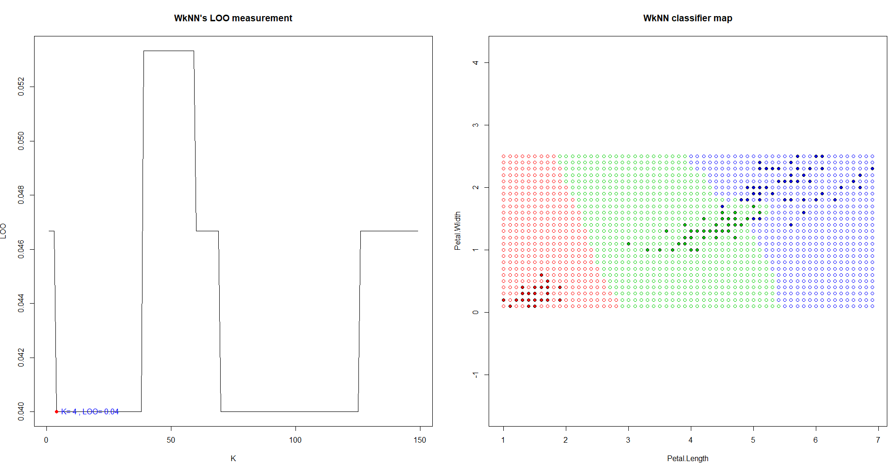

# Weighted kNN

**Взвешенный kNN** - метрический классификатор, отличается от kNN тем, что функция веса в исходной формуле приобрела решающее значение - объект относится к классу, который набрал наибольший вес среди первых _k_ соседей.

Вес соседа, в свою очередь, выглядит так   
q, предполагается, <1. Т.е, убывающая с нарастанием k и, соответственно, расстояния. Для весовой функции была взята 

### Code implementation

Код, в общем - то, тот же, разница лишь в самой функции WkNN, которая отличается от kNN наличием функции веса.
Стоит отметить невероятно полезное семейство функций (s/l)apply, которая позволяет использовать набор данных как список или вектор,применяя функцию к каждому элементу. sapply работает только со строками(элементами вектора), apply может работать и со столбцами, применяя к ним различные функции (в том числе и пользовательские)

```R
DT.WkNN.weight = function(i, k) return((k + 1 - i) / k) # i - номер соседа, k - количество соседей
```
```R
DT.WkNN.WkNN = function(sortedDist, k) {
  kDist = sortedDist[1:k]
  w = DT.WkNN.weight(1:k, k) #находим веса первых k соседей
  names(w) = names(kDist) #связываем их с классами соответствующих точек
  w = sapply(unique(names(w)), function(class, ar) sum(ar[names(ar) == class]), w)
#представляем все классы в w как последовательность, сравниваем и суммируем веса элементов одного класса
  return(names(which.max(w)))
#возвращаем класс с максимальным весом элементов
}
```
### Summary



Используется датасет iris по лепесткам для классификации.
В данном случае оптимальное _k = 4_ с ошибкой _0.04_, это ~ 6 неправильно классифицированных точкам.

Главное отличие **KwKNN** - классификация не ухудшается при росте _k_. Как было упомянуто,алгоритм учитывает не только наличие точки среди ближайших _k_-соседних, но также и ее порядок, вследствие чего дальние соседи на классификацию практически не влияют.

----

[go to index](../README.md)

[Next - PW](PW.md)

