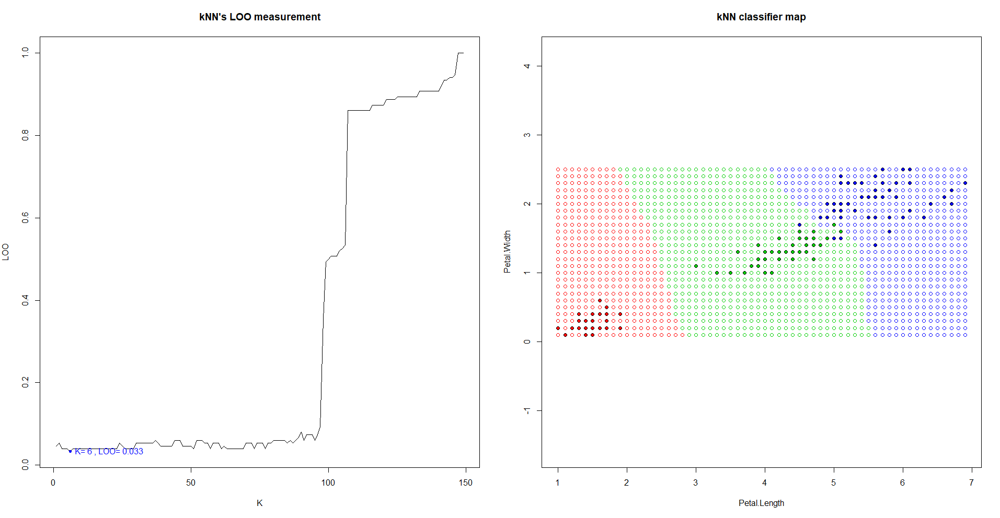

# KNN

- **KNN** - метрический алгоритм классификации, основанный на оценивании сходства объектов. Классифицируемый объект относится к тому классу, которому принадлежат ближайшие к нему объекты обучающей выборки. 

Данный алгоритм, как и пара следующих рассмотренных методов, основываются на _**гипотезе компактности:**_ если мера сходства объектов введена достаточно удачно, то схожие объекты гораздо чаще лежат в одном классе, чем в разных. В этом случае граница между классами имеет достаточно простую форму, а классы образуют компактно локализованные области в пространстве объектов. 

Пусть задана обучающая выборка пар «объект-ответ».

Пусть на множестве объектов задана функция расстояния . Эта функция должна быть достаточно точной _"мерой"_ сходства объектов.
Для точки **_u_** выборки отсортируем остальные её объекты по возрастанию значения расстояния до **_u_**.
Для успешного обучения выборка должна быть пересортирована для каждого новой точки **_u_**. 

В общем виде алгоритм **_kNN_** выглядит так :
,
где  — мера _«важности»_ (вес) объекта 

Алгоритм зависит от параметра _k_, оптимальное значение которого определяется по критерию скользящего контроля,в нашем случае используется метод исключения объектов по одному (leave-one-out cross-validation).

**_Проще говоря_**, алгоритм от произвольной точки _U_ сортирует остальную выборку по расстоянию до _U_, и _относит её к классу_, который имеет максимальное значение объектов среди первых **_K_** соседей **U**.

### Code implementation

Src: [тыц](../kNN.R)  
Основной интерес реализации заключён в двух функциях:

## KNN
```R
#Функция получает в качестве параметров отсортированную выборку и количество ближайших соседей
DT.kNN.kNN = function(sortedDist, k) { 
    kDist = sortedDist[1:k] #Берём только первых K отсортированных объекта выборки
    kClasses = names(kDist) #получаем названия классов первых K соседей с помощью функции names()
    class = names(which.max(table(kClasses))) 
    #функция возвращает название класса, объектов которого больше всего среди K соседей.
    return(class)
}
```
## LOO
Данная функция была обобщена для трёх классификаторов и была вынесена в отдельный исходник,функция принимает points - массив точек обучающей выборки, в нашем случае - столбцы матрицы iris[,3:4];  
classes - столбец с названиями классов элементов выборки, iris[,5]  
Для определения классификатора и выбора соответствующего варианта подсчёта LOO передаётся функция классификатора; hlim - параметр для Парзеновского окна, для kNN не имеет значения
```R
DT.Util.LOO = function(points, classes, classFunc, hLims = 0) {
  n = dim(points)[1]# берём количество элементов из первого столбца
  if(identical(classFunc, DT.kNN.kNN) || identical(classFunc, DT.WkNN.WkNN)) { #сравнение методов,см выше
  loo = double(n-1) #n-1 поскольку мы всегда удаляем один элемент для LOO
  
  for (i in 1:n) { #идём по выборке
  #находим эвклидовы расстояния от нашей точки до оставшейся выборки без нашей точки - points[-i]
    distances = DT.Util.getDist(points[-i,], points[i,], DT.Util.euclidDist) 
    names(distances) = classes[-i] #присваиваем имена классов точек в массиве расстояния
    sortDist = sort(distances) #сортируем по расстоянию
    #вложенный цикл нужен для подсчёта 
    for (l in 1:n - 1) { 
      bestClass = classFunc(sortDist, l) #вызов kNN для l соседей
      loo[l] = loo[l] + ifelse(bestClass == classes[i], 0, 1) 
      } #если классификатор ошибся, увеличиваем LOO при l соседях
    }
  } # вот так вот просто можно поделить весь массив на число элементов выборки
    loo = loo / n
  return(loo)
}
```

### Summary



Используется датасет iris по лепесткам (ширина и длина -наиболее подходящие для классификации параметры )

Подбор оптимального количества соседней (_k_) отображается на графике **LOO** слева. Для реализованного классификатора _k_ = 6, при **_LOO_** равное 0.033, что соответствует ~5 неправильно классифицируемым элементам выборки.

Параметр _k_, как видно на графике LOO, в первой сотне имеет относительно низкий показатель ошибок классификации, при больших показателях _k_ погрешность стремительно растёт. Происходит это из - за фундаментального недостатка самого алгоритма **KNN**, который **не**
учитывает расстояние точки до соседей, учитывая <u>только</u> их наличие (Исправлено в ***kWNN***). Т.е, у **_n_**-ого соседа будет **"вес"** как у, например, ближайшего.  

----

[go to index](../../README.md)

[Next - WkNN](WkNN.md)
